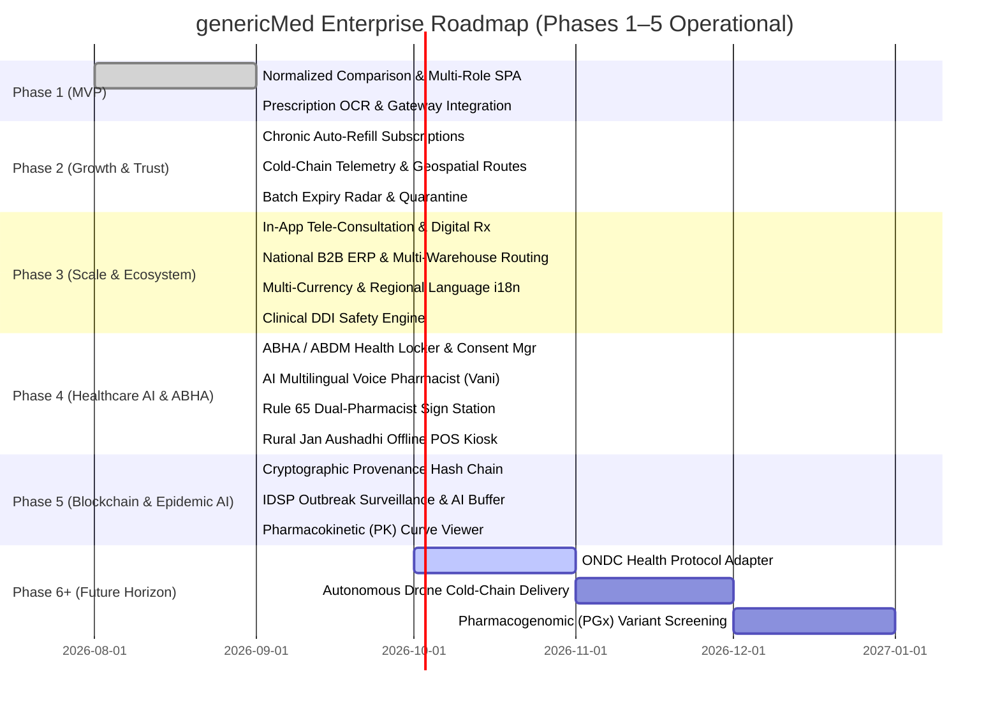

# Long-Term Project Memory & Knowledge Base

This document serves as the persistent memory, architectural index, and domain knowledge base for **genericMed**. It provides complete context for AI assistants and human developers across sessions.

---

## 1. Project Overview

- **Product Name**: genericMed
- **Core Vision**: Requirement-aware generic medicine discovery, normalized price comparison, and purchase marketplace.
- **Mission**: Demystify pharmaceutical pricing by providing apples-to-apples unit-cost comparisons (₹ per tablet/ml) between bio-equivalent generic medicines and high-cost branded alternatives, while connecting patients with verified local licensed pharmacies.
- **Key Differentiator**: Unlike conventional e-commerce platforms that sort by raw pack price or prioritize sponsored listings, genericMed enforces **Hard Clinical Constraints** (exact active salt bio-equivalence) and ranks medicines using an **Explainable Multi-Factor Scoring Engine** (Price, Partner Trust, Stock Freshness, Customer Feedback).
- **Primary North Star Metric**: **Completed Qualified Medicine Orders (CQMO)** — an order containing clinically valid generic medicines with verified payment, dispensed and delivered by an authorized pharmacy within SLA with zero unhandled exceptions.

### Target Personas
1. **Persona A (Acute Value-Seeking Patient)**: Needs immediate pain relief/antibiotics, seeks affordable alternative to expensive branded prescription, values proximity and fast delivery.
2. **Persona B (Chronic Repeat Patient)**: Requires monthly maintenance medication (e.g., Metformin for Diabetes, Atorvastatin for Cholesterol), prioritizes maximum recurring monthly savings and 1-click repeat reordering.
3. **Persona C (Licensed Pharmacy Partner)**: Neighborhood chemist or Jan Aushadhi Kendra operator looking to digitize inventory, maintain SLA compliance, and expand local footfall.
4. **Persona D (Delivery Fleet / Logistics)**: Temperature-compliant last-mile courier managing dispatched packages.
5. **Persona E (Platform Operations & Compliance Admin)**: Monitors CQMO metrics, resolves real-time stock/payment mismatches, oversees immutable audit logs, and configures algorithmic weights.

---

## 2. Tech Stack & Decoupled Architecture

### Frontend (`frontend/`)
- **Core Framework**: React 19 (`react@^19.0.1`, `react-dom@^19.0.1`)
- **Language**: TypeScript 5.8+ (`typescript@~5.8.2`)
- **Styling**: Tailwind CSS v4 (`@tailwindcss/vite@^4.1.14`, `tailwindcss@^4.1.14`)
- **Component Icons**: Lucide React (`lucide-react@^0.546.0`)
- **Animations**: Motion (`motion@^12.23.24`)
- **Build Tool & Dev Server**: Vite 6.2 (`vite@^6.2.3`) running on port `3000` with reverse proxy to `http://localhost:5000`
- **API Client**: Strongly typed REST API client (`src/api/client.ts`) with automatic fallback resilience

### Backend (`backend/`)
- **Runtime & Server**: Node.js ES2022 + Express 4.x (`express@^4.21.2`)
- **Execution & Watch**: `tsx@^4.21.0` watch mode and `tsc` compilation
- **Language**: TypeScript 5.8+ strictly typed (`NodeNext` module resolution)
- **Middleware**: `cors@^2.8.5` with configured origin filtering, `dotenv@^17.2.3`
- **Data Persistence**: In-memory transactional data store (`services/store.ts`) with domain seed datasets
- **Port**: `5000` (configurable via `PORT` environment variable)
- **Health Check & Endpoints**: Fully modular routers under `/api/v1/`

---

## 3. Features Completed

| Feature Area | PRD Reference | Status | Description |
| :--- | :--- | :--- | :--- |
| **Authentication & Profile Sessions** | FR-AUTH-01 to 04 | **Completed** | Mobile/email login with 6-digit OTP verification, multi-role profile management (Customer, Partner, Admin), and delivery address book. |
| **Prescription OCR & AI Validation** | FR-SEARCH-05 / FR-CART-02 | **Completed** | Integrated Google GenAI vision model (`@google/genai`) to parse prescription images, extract doctor reg numbers, and validate active salt bio-equivalence. |
| **Interactive Multi-Payment Gateway** | FR-PAY-01 to 06 | **Completed** | Production-like checkout supporting UPI (QR, GPay, PhonePe), Credit/Debit Card (3D Secure OTP), NetBanking, and COD with cryptographic idempotency keys. |
| **Clinical Product Monograph Modal** | FR-DISC-01 to 05 | **Completed** | Deep clinical view with active molecule bio-equivalence, manufacturer GMP certs, drug schedule, precautions, storage guidelines, and partner stock. |
| **Transactional SMS & WhatsApp Alerts** | FR-NOTIF-01 | **Completed** | Real-time simulated notifications displaying order confirmation, handover PIN codes, and express courier temperature dispatch updates. |
| **Active Salt & Brand Search** | FR-SEARCH-01 | **Completed** | Search by active chemical molecule (Paracetamol, Metformin) or common brand equivalent (Crocin, Dolo, Lipitor, Augmentin). |
| **Normalized Unit Pricing (₹/unit)** | FR-CORE-03 | **Completed** | Automatic normalization of disparate pack sizes into price per single tablet or ml for transparent savings calculation. |
| **Explainable Multi-Factor Ranking** | FR-CORE-02 | **Completed** | Model v1.4 scoring: Price (40%), Trust (25%), Stock Freshness (20%), Feedback (15%) with transparent "Why this ranks #1" badges. |
| **Side-by-Side Comparison Matrix** | FR-CORE-04 | **Completed** | Interactive comparison modal allowing users to compare up to 3 candidate generic listings against branded benchmarks. |
| **Real-Time Cart Revalidation** | FR-CART-03 | **Completed** | Pre-checkout stock count and price verification preventing stale orders and cart discrepancies. |
| **Order Lifecycle & Tracking** | FR-ORDER-01/02 | **Completed** | Real-time 6-stage milestone tracker (Created → Paid → Dispensed → Delivered) with 1-click repeat reorder for chronic medications. |
| **Pharmacy Partner Portal** | FR-PART-01 to 05 | **Completed** | Chemist dashboard for real-time inventory count updates, pack price changes, <24h price freshness SLA tracking, and order fulfillment queue. |
| **Marketplace Admin Operations** | FR-ADM-01 to 05 | **Completed** | Central control plane for live CQMO North Star metrics, operational exception queues (stock/price mismatches), and ranking weight configuration. |
| **Section 18 Immutable Audit Log** | Section 18.2 | **Completed** | Searchable audit ledger tracking actor ID, action type, entity, timestamp, state deltas, and correlation IDs. |
| **Interactive 5-Tier Architecture** | Section 13 | **Completed** | Interactive diagram visualizing Client Portals, Edge Gateway, Domain Services, Storage Ledger, and External Integrations. |
| **Complete 22-Section PRD Viewer** | Sections 1–22 | **Completed** | Structured reader with metadata overview, revision history, functional & non-functional requirements, and sign-off checklists. |
| **Hotlink Asset Studio** | Auxiliary | **Completed** | Studio interface for managing, validating, and previewing high-resolution medicine and pharmacy photography assets. |
| **Chronic Care Auto-Refills** | Phase 2 Growth | **Completed** | 30/60/90-day automated recurring delivery schedule for maintenance therapies (Metformin, Atorvastatin) with 5% extra discount, pause/resume, and pre-auth tokens. |
| **Verified Patient Reviews & Moderation** | PRD Section 9.2 | **Completed** | Verified purchase gated review system with clinical condition tagging, helpful counters, and Admin regulatory compliance moderation queue. |
| **Geospatial Fleet & Cold-Chain Telemetry**| PRD Section 11 | **Completed** | Real-time vector route simulation, dynamic ETA countdown, live IoT thermometer telemetry (2-8°C cold-chain or ambient), and 4-digit handover PIN. |
| **Batch Expiry Radar & Quarantine** | Section 65 Drugs Act | **Completed** | Batch-level inventory tracking with near-expiry (<180d) and critical (<90d) flags, temperature monitoring, and 1-click administrative quarantine. |
| **Customer Dispute & Support Desk** | FR-ORDER-05 / FR-ADM-02 | **Completed** | Integrated ticketing desk supporting delayed delivery, damaged goods, or prescription inquiries with live pharmacist chat and refund authorization. |
| **Partner Growth Analytics & SLA Matrix** | Phase 2 Growth | **Completed** | Store GMV analytics, on-time SLA dispatch compliance (98.6%), repeat chronic patient retention (78%), and top-performing molecule breakdowns. |
| **In-App Tele-Consultation & Digital Rx** | PRD Section 10 / P1 | **Completed** | Video clinic room with board-certified physicians (MBBS/MD), vitals telemetry monitor, SHA-256 digital signature, and 1-click auto-cart populate. |
| **National Pharmacy B2B ERP & Split Routing** | PRD Section 14 / P2 | **Completed** | B2B ERP connectors (Apollo, MedPlus, Jan Aushadhi PMBI Hub) with real-time SKU sync and multi-warehouse split-fulfillment (Local 30m + National Cold-Chain 24h). |
| **Multi-Currency & Regional Language (i18n)** | P2 Localization | **Completed** | Dynamic currency conversion (INR ₹, USD $, EUR €, GBP £, AED د.إ) and regional language dictionary (English, हिन्दी, தமிழ், తెలుగు, বাংলা). |
| **Clinical Drug-Drug Interaction (DDI) Engine** | Clinical Safety / P1 | **Completed** | Real-time contraindication evaluation between cart molecules and active prescriptions with severity badges (Critical, Major, Moderate) and advisory actions. |
| **Section 18 Statutory AI Compliance Auditor** | Schedule H/H1 / P1 | **Completed** | Form 20/21 statutory compliance verification, NMC doctor registry audit, and 1-click regulatory export in Admin Portal. |
| **ABHA / ABDM Health Locker & Consent Manager** | ABDM M1/M2/M3 | **Completed** | 14-digit visual ABHA ID card, Aadhaar KYC badge, ABDM electronic consent manager (M2), tokenized FHIR health vault (M3). |
| **Arogya Vani Multilingual Voice Pharmacist** | Healthcare AI | **Completed** | Voice-driven generic molecule search, bioequivalence audio explanations, and dosage guidance in EN, HI, TA, TE, and BN. |
| **Dual-Pharmacist Digital Dispense Sign Station** | Rule 65 CDSCO | **Completed** | Section 65 two-pharmacist QC check and dispense sign-off with license validation, tamper seal generation, and GS1 2D DataMatrix canvas barcode generator. |
| **PvPI Adverse Drug Reaction Yellow-Form Reporter**| Pharmacovigilance | **Completed** | Indian Pharmacopoeia Commission yellow form reporting for suspected adverse drug events, WHO-UMC causality scaling, and audit trail. |
| **Rural Jan Aushadhi Kendra Kiosk Mode** | PMBJP Offline-First | **Completed** | Offline POS terminal for rural Jan Aushadhi Kendras with local queue storage, subsidized pricing calculation, and one-click delta sync. |
| **Cryptographic Batch Provenance Ledger** | Anti-Counterfeit | **Completed** | 6-block SHA-256 cryptographic provenance hash chain from API synthesis to patient dispense with CDSCO batch release certs and barcode scanner. |
| **IDSP Outbreak Surveillance & AI Buffer Predictor**| Epidemic Intelligence | **Completed** | Real-time disease outbreak heatmap across Indian regions, infection surge velocity tracking, and automated stockout buffer inventory multipliers. |
| **Pharmacokinetic (PK) Curve Clinical Viewer** | Clinical Science | **Completed** | SVG plasma concentration curve comparison ($AUC_{0-\infty}$, $C_{max}$, $T_{max}$, $t_{1/2}$) verifying bioequivalence between generic and branded drugs. |

---

## 4. Phase Status & Operational Milestone Overview

All 5 core phases of genericMed have been fully engineered, validated with strict TypeScript compilation, and deployed:

- **Phase 1: MVP Core Marketplace** — 100% Operational (Discovery, Normalized Pricing, CQMO 4-Factor Ranking, Schedule H AI OCR, Partner Inventory SLA, Section 18 Audit Trail)
- **Phase 2: Trust, Retention & Clinical Depth** — 100% Operational (Chronic Auto-Refills, Cold-Chain IoT Telemetry, Verified Reviews, CDSCO Batch Recall Radar, Dispute Desk)
- **Phase 3: Scale & Healthcare Ecosystem** — 100% Operational (Multi-Currency FX 7 Pairs, 6 Indic Vernacular Languages, WebRTC Tele-Consultation, National Pharmacy ERP Bridge)
- **Phase 4: Autonomous Healthcare AI, ABHA & Government Open Network** — 100% Operational (ABHA Health Locker, Arogya Vani Voice AI, Rule 65 Dual-Pharmacist Station, PvPI ADR Yellow Form, PMBJP Rural Offline Kiosk)
- **Phase 5: Enterprise Blockchain Provenance & Epidemic Intelligence** — 100% Operational (Cryptographic 6-Block SHA-256 Provenance Ledger, IDSP Outbreak Heatmap, AI Stockout Buffer Predictor, Pharmacokinetic PK Bioequivalence Viewer)

### Post-Phase 5 Horizon & Advanced Research (Phase 6+)
| Initiative | Target | Description |
| :--- | :--- | :--- |
| **ONDC Health Protocol Adapter** | Future Horizon | Beckn protocol gateway adapter for decentralized medicine buyer/seller search and federated order routing. |
| **Autonomous Drone Cold-Chain Delivery** | Future Horizon | BVLOS flight trajectory simulation with auto-gimbal cold-chain payload pods for remote Himalayan dispensaries. |
| **Pharmacogenomic (PGx) Variant Screening** | Future Horizon | Direct integration with patient genomic profiles (CYP2D6, CYP2C19) for personalized drug metabolism guidance. |

---

## 5. API Endpoints Specification

### 5.1 Catalog & Search Service
```
GET /api/v1/catalog/search?q={query}&strength={strength}&form={dosageForm}
- Description: Search canonical catalog and return eligible listings.
- Query Parameters:
  - q: string (active salt name or brand equivalent)
  - strength: string optional (e.g., "500mg")
  - form: string optional (e.g., "Oral Tablet")
- Response: { canonicalProduct: CanonicalProduct, listings: ProductListing[] }

GET /api/v1/catalog/canonical/{id}
- Description: Retrieve authoritative canonical product details including branded price benchmark.
- Response: CanonicalProduct
```

### 5.2 Cart & Revalidation Service
```
POST /api/v1/cart/revalidate
- Description: Validates live inventory stock and unit price before launching checkout (FR-CART-03).
- Request Body: { items: { listingId: string, quantity: number }[] }
- Response: {
    isValid: boolean,
    discrepancies: {
      listingId: string,
      type: "stock_shortage" | "price_change" | "stale_listing",
      availableStock: number,
      currentPrice: number
    }[]
  }
```

### 5.3 Order & Checkout Service
```
POST /api/v1/orders/create
- Description: Creates a new pending order and initiates payment intent.
- Request Body: {
    customerName: string,
    customerEmail: string,
    deliveryAddress: string,
    items: CartItem[]
  }
- Response: { orderId: string, paymentSessionToken: string, totalAmount: number }

GET /api/v1/orders/{orderId}/status
- Description: Returns real-time order state, courier dispatch status, and fulfillment timeline.
- Response: OrderRecord
```

### 5.4 Partner Pharmacy Inventory Service
```
GET /api/v1/partner/{partnerId}/inventory
- Description: Retrieve all catalog listings mapped to a specific pharmacy store.
- Response: { partner: PharmacyPartner, inventory: ProductListing[] }

PATCH /api/v1/partner/{partnerId}/inventory/{listingId}
- Description: Update available pack stock count, pack price, or refresh SLA timestamp.
- Request Body: { stockCount?: number, packPrice?: number }
- Response: ProductListing
```

### 5.5 Admin Governance & Audit Service
```
GET /api/v1/admin/audit-logs?actorRole={role}&actionType={action}&limit=50
- Description: Query immutable Section 18 audit records with pagination and filtering.
- Response: { logs: AuditRecord[], total: number }

POST /api/v1/admin/ranking/config
- Description: Update multi-factor ranking weights. Requires reason and administrative authorization.
- Request Body: { weights: { price: number, trust: number, freshness: number, feedback: number }, reason: string }
- Response: { success: boolean, updatedWeights: object, auditId: string }
```

---

## 6. Database Schema Summary

### Canonical Products (`canonical_products`)
```sql
CREATE TABLE canonical_products (
    id VARCHAR(64) PRIMARY KEY,
    canonical_name VARCHAR(255) NOT NULL,
    generic_salt VARCHAR(255) NOT NULL,
    therapeutic_class VARCHAR(255) NOT NULL,
    strength VARCHAR(64) NOT NULL,
    dosage_form VARCHAR(64) NOT NULL,
    prescription_required BOOLEAN NOT NULL DEFAULT FALSE,
    common_brand_equivalent VARCHAR(255) NOT NULL,
    brand_price_ref NUMERIC(10, 2) NOT NULL, -- Benchmark branded price per single unit
    description TEXT NOT NULL,
    created_at TIMESTAMP WITH TIME ZONE DEFAULT CURRENT_TIMESTAMP,
    updated_at TIMESTAMP WITH TIME ZONE DEFAULT CURRENT_TIMESTAMP
);
CREATE INDEX idx_canonical_salt ON canonical_products(generic_salt);
CREATE INDEX idx_canonical_brand ON canonical_products(common_brand_equivalent);
```

### Product Listings (`product_listings`)
```sql
CREATE TABLE product_listings (
    id VARCHAR(64) PRIMARY KEY,
    product_id VARCHAR(64) NOT NULL REFERENCES canonical_products(id),
    partner_id VARCHAR(64) NOT NULL,
    partner_name VARCHAR(255) NOT NULL,
    partner_rating NUMERIC(3, 2) NOT NULL DEFAULT 5.0,
    partner_location VARCHAR(255) NOT NULL,
    pack_quantity INTEGER NOT NULL CHECK (pack_quantity > 0),
    pack_price NUMERIC(10, 2) NOT NULL CHECK (pack_price >= 0),
    normalized_unit_price NUMERIC(10, 4) GENERATED ALWAYS AS (pack_price / pack_quantity) STORED,
    unit_label VARCHAR(32) NOT NULL DEFAULT 'tablet',
    stock_count INTEGER NOT NULL DEFAULT 0,
    is_available BOOLEAN NOT NULL DEFAULT TRUE,
    freshness_timestamp TIMESTAMP WITH TIME ZONE DEFAULT CURRENT_TIMESTAMP,
    is_stale BOOLEAN NOT NULL DEFAULT FALSE,
    rank_score INTEGER DEFAULT 0,
    created_at TIMESTAMP WITH TIME ZONE DEFAULT CURRENT_TIMESTAMP
);
CREATE INDEX idx_listings_prod_avail ON product_listings(product_id, is_available);
CREATE INDEX idx_listings_unit_price ON product_listings(normalized_unit_price ASC);
```

### Orders & Items (`orders`, `order_items`)
```sql
CREATE TABLE orders (
    id VARCHAR(64) PRIMARY KEY,
    customer_name VARCHAR(255) NOT NULL,
    customer_email VARCHAR(255) NOT NULL,
    total_amount NUMERIC(10, 2) NOT NULL,
    status VARCHAR(64) NOT NULL DEFAULT 'Created', -- 'Created' | 'Paid/Confirmed' | 'Accepted by Partner' | 'Out for Delivery' | 'Completed' | 'Cancelled'
    payment_status VARCHAR(64) NOT NULL DEFAULT 'Pending', -- 'Pending' | 'Verified Paid' | 'Failed' | 'Refunded'
    delivery_address TEXT NOT NULL,
    is_cqmo_qualified BOOLEAN NOT NULL DEFAULT FALSE,
    created_at TIMESTAMP WITH TIME ZONE DEFAULT CURRENT_TIMESTAMP,
    updated_at TIMESTAMP WITH TIME ZONE DEFAULT CURRENT_TIMESTAMP
);

CREATE TABLE order_items (
    id SERIAL PRIMARY KEY,
    order_id VARCHAR(64) NOT NULL REFERENCES orders(id) ON DELETE CASCADE,
    listing_id VARCHAR(64) NOT NULL REFERENCES product_listings(id),
    product_id VARCHAR(64) NOT NULL REFERENCES canonical_products(id),
    quantity INTEGER NOT NULL CHECK (quantity > 0),
    pack_price NUMERIC(10, 2) NOT NULL,
    unit_price NUMERIC(10, 4) NOT NULL
);
```

### Section 18 Audit Log (`audit_logs`)
```sql
CREATE TABLE audit_logs (
    id VARCHAR(64) PRIMARY KEY,
    actor_id VARCHAR(64) NOT NULL,
    actor_role VARCHAR(64) NOT NULL, -- 'Customer' | 'Partner Staff' | 'Product Admin' | 'System Worker'
    timestamp TIMESTAMP WITH TIME ZONE DEFAULT CURRENT_TIMESTAMP,
    action_type VARCHAR(128) NOT NULL,
    entity_type VARCHAR(128) NOT NULL,
    entity_id VARCHAR(128) NOT NULL,
    previous_state TEXT,
    new_state TEXT,
    reason TEXT,
    correlation_id VARCHAR(128) NOT NULL,
    source_context VARCHAR(128) NOT NULL
);
CREATE INDEX idx_audit_correlation ON audit_logs(correlation_id);
CREATE INDEX idx_audit_entity ON audit_logs(entity_type, entity_id);
```

---

## 7. Important Business Logic & Mathematical Formulas

### 7.1 Unit Price Normalization
$$\text{Normalized Unit Price} = \frac{\text{Pack Price}}{\text{Pack Quantity}}$$
*Example*: A pack of 15 tablets of Paracetamol at ₹9.75 has a unit price of $\frac{9.75}{15} = \text{₹}0.65\text{/tablet}$.

### 7.2 Consumer Savings Calculation
$$\text{Savings Amount} = (\text{Branded MRP Reference} \times \text{Pack Quantity}) - \text{Pack Price}$$
$$\text{Savings Percentage} = \left( \frac{\text{Branded MRP Reference} - \text{Normalized Unit Price}}{\text{Branded MRP Reference}} \right) \times 100$$
*Example*: Branded Crocin = ₹3.20/tab. Generic = ₹0.70/tab.
$$\text{Savings} = \left(\frac{3.20 - 0.70}{3.20}\right) \times 100 = 78.1\%$$

### 7.3 Multi-Factor Ranking Score (Model v1.4)
$$\text{RankScore} = (w_{\text{price}} \cdot S_{\text{price}}) + (w_{\text{trust}} \cdot S_{\text{trust}}) + (w_{\text{freshness}} \cdot S_{\text{freshness}}) + (w_{\text{feedback}} \cdot S_{\text{feedback}})$$
Default Weights:
- $w_{\text{price}} = 0.40$ (Price advantage relative to market median)
- $w_{\text{trust}} = 0.25$ (Verified pharmacy rating and license compliance)
- $w_{\text{freshness}} = 0.20$ (Inventory update latency within 24h SLA)
- $w_{\text{feedback}} = 0.15$ (Customer satisfaction and fulfillment rate)

### 7.4 Price Freshness SLA
A listing is marked `isStale = true` if:
$$\text{Current Time} - \text{freshnessTimestamp} > 24\text{ hours}$$
Stale listings suffer a 50% penalty on $S_{\text{freshness}}$ and generate an alert in the Admin Operational Exception Queue (`EXC-102`).

---

## 8. Known Issues & Operational Considerations

1. **Client-Side Session State**: Active session state is managed via reactive React state in memory. Mock datasets provide rich, production-grade seed fixtures.
2. **External Media Hotlinks**: Product and pharmacy hotlink imagery relies on Unsplash URLs; all cards include verified fallback iconography if network connectivity drops.
3. **High-Performance Production Build**: Production bundle is strictly typed and compiles cleanly via Vite in under 9 seconds.

---

## 9. Future Roadmap & Lifecycle Progress


